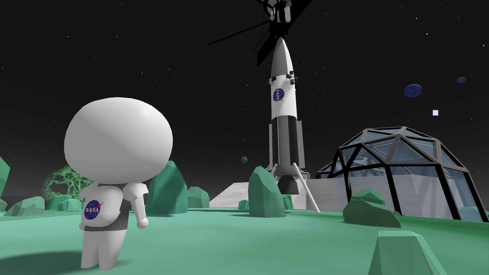
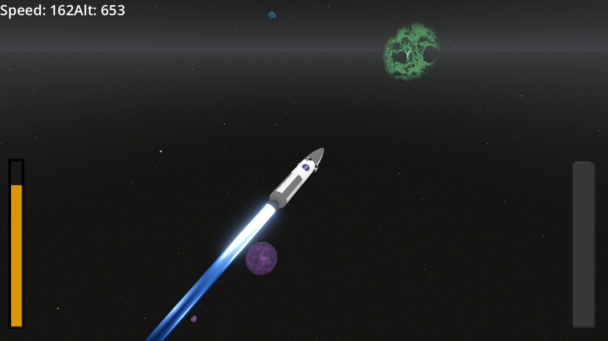
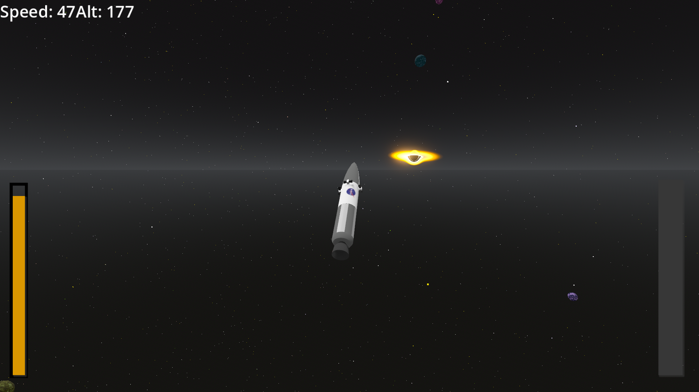
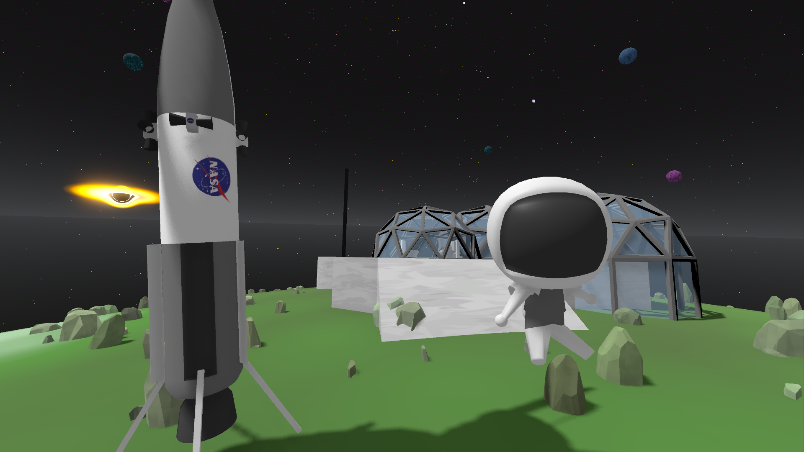

# Into the Cosmos

*A KSP and Spaceflight Simulator inspired sandbox game about realistic space travel, built for people who just want to relax and enjoy flying through space.*

  

[Click here to watch the gameplay video on YouTube](https://youtu.be/RQmEh_rwnzQ) |
[Click here to view all the devlogs related to this project](https://stardance.hackclub.com/projects/25109)

## Download

Download the latest release from the GitHub Releases page and launch the executable.

> **Note:** The current release has well documented controls and instructions on how to get your spacecraft into orbit. If you're new, you can also press **ESC** to open the Settings menu and enable the on-screen keybind guide.

Im sorry i couldnt provide a web link for easy acess, unfortunately this project uses multithreading so i couldnt get that to work with netlify, cloudflare or itch hosting. :(

---

# About

Into the Cosmos is a KSP and Spaceflight Simulator inspired game about realistic space travel.

I made this game to be a fun sandbox project where you don't need to spend hours building, tweaking, and tinkering with your rocket just for it to fail at the last moment.

Instead, the focus is on flying, exploring, and experiencing space. The game features an effectively infinite procedurally generated universe filled with unique planets waiting to be discovered. Every planet is generated procedually, so theres no limit to the size of universe, **This game also features farlands, if you go far enough youll start experincing what im talking about**.

As you explore, you can land on planets, build observatories, refuel your spacecraft, and continue venturing farther into the universe **keep in mind 1 planet only can hold 1 observatory**.

This game was made to be a fun and relaxing experience that someone can open after a long day of school or work and simply enjoy flying through space from the comfort of their couch.

This project was made in **Godot 4.6.2** as my submission for **Hack Club Stardance**. It is a realistic physics simulation of space bodies and how spacecraft have to move in order to successfully reach orbit.

---

  

# Quick Start

1. Download the latest release.
2. Launch the executable.
3. Read the controls and instructions.
4. Press **ESC** to open the Settings menu if you want to enable the on-screen controls guide.
5. Launch your rocket.
6. Deploy your satellite.
7. Explore the universe.

---

  

# How It Works

The game simulates realistic gravity and orbital mechanics, meaning you have to launch and maneuver your spacecraft just like you would in real life if you wanted to successfully reach orbit.

Both the rocket and the satellite have their own RCS controls, allowing you to orient yourself and perform orbital corrections after deployment.

The universe is procedurally generated, allowing you to travel through an effectively infinite number of unique planets. Every planet can be explored, landed on, and **used as a stepping stone for your next adventure.**

You can construct observatories on planets throughout the universe. These observatories become useful exploration outposts, allowing you to return to previously visited planets and continue expanding your journey.

Landing your rocket on an observatory's landing pad allows you to interact with it and completely refuel your spacecraft before heading back into space.

To make exploring space feel more immersive, the game includes custom raymarched nebula and black hole shaders, adding beautiful sights throughout the universe.

The game also includes a full in-game Settings menu where you can configure graphics, display options, and gameplay settings. All settings are automatically saved between sessions, so your preferences are never lost.

Make sure you have fun with our protagonist **Boney**.

The goal was to make realistic orbital mechanics approachable without requiring players to spend hours designing rockets before they can actually enjoy flying them.

---

  

# Development

This project started as an experiment in realistic orbital mechanics and gradually evolved into a much larger space exploration.

Over the course of development I continually redesigned and improved existing systems, adding procedural planet generation, observatories, graphics settings, configuration saving, improved controls, visual effects, and many quality-of-life improvements.

A significant amount of time was also spent optimizing the game. I tried to optimize every system as much as I possibly could within the time available, rewriting large parts of the project to improve performance while keeping the visuals as impressive as possible. The goal has always been to deliver the smoothest and most enjoyable experience I could.

---

# Future

This is only the beginning for Into the Cosmos.

Some of the features I plan to add include:

* Multiplayer
* More planets and celestial bodies
* Planetary bases
* Research systems
* Resource gathering
* More spacecraft
* Space stations
* Docking
* More exploration mechanics
* Base building
* Raiding your friends' bases
* Launching missiles at enemy bases
* More visual effects
* More procedural content
* Even more things to discover throughout the universe

---

# Credits

**Engine**

* Godot 4.6.2

**Models and Assets**

* Blender

**External Assets**

Satellite 3D Model

https://sketchfab.com/3d-models/sattelite-c6048c0a71064df3b1cc0ddef2f3ae6a

---

Thank you for checking out my game. I hope you have as much fun exploring the universe as I had building it 
