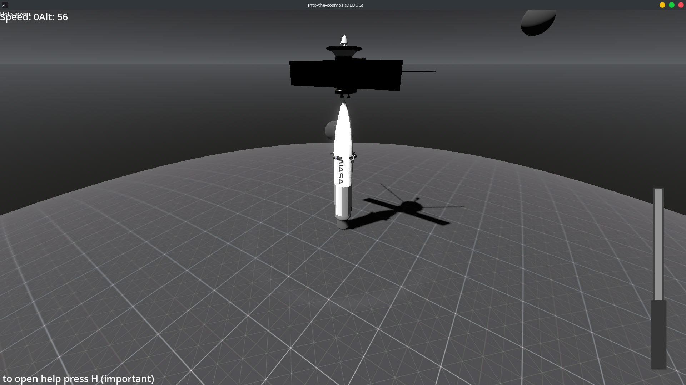
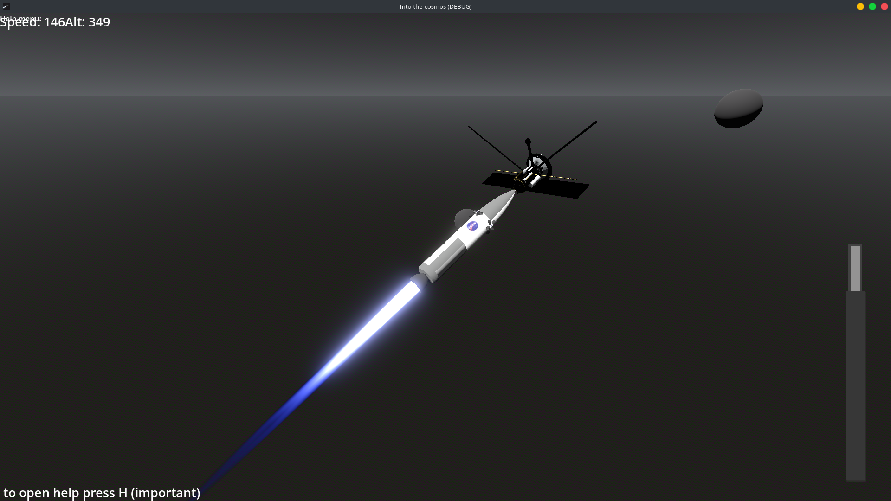
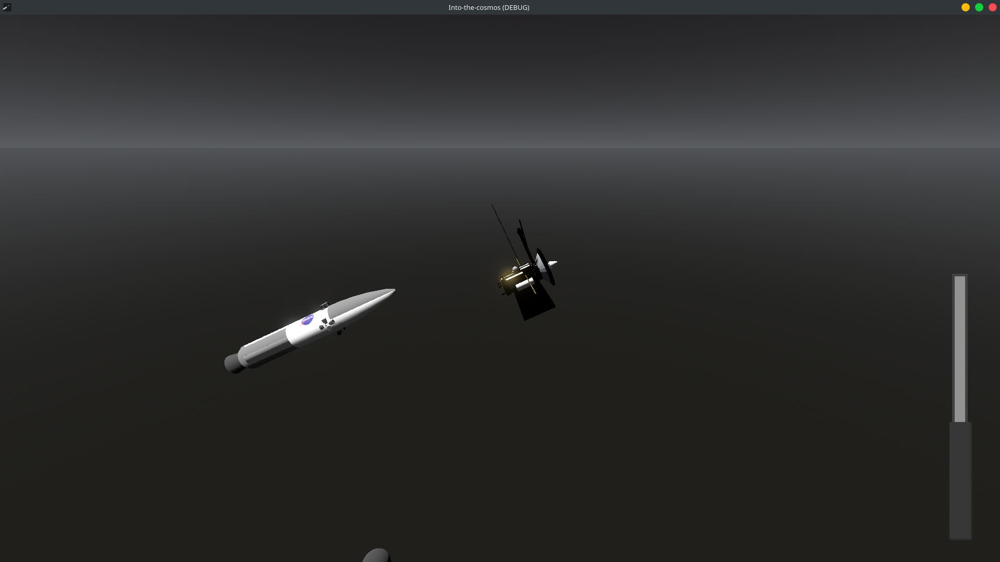
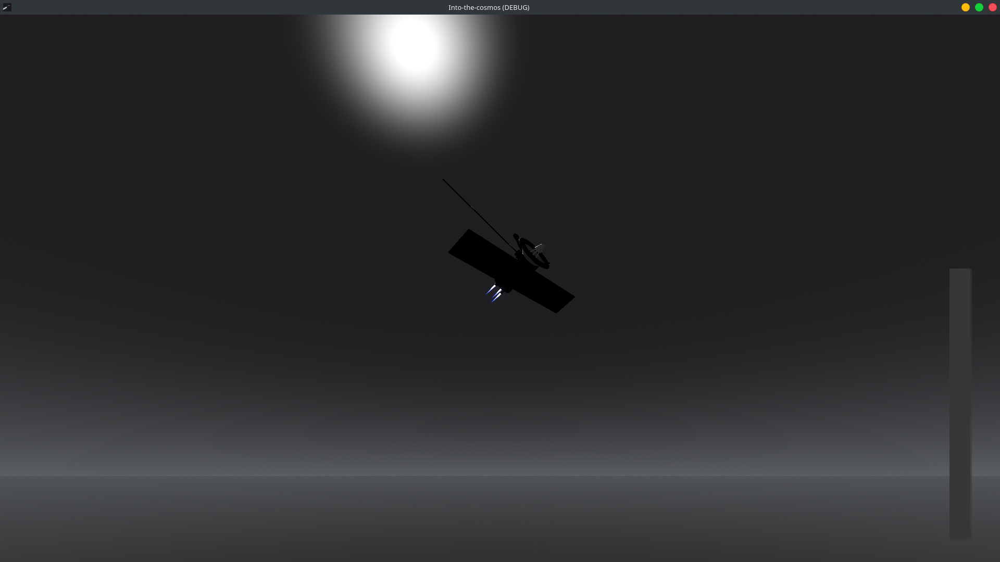

# Into the Cosmos

*A KSP and Spaceflight Simulator inspired sandbox game about realistic space travel, built for people who just want to relax and enjoy flying through space.*

  

[Click here to watch the gameplay video on YouTube](https://youtu.be/EsZQD3edJl4) |
[Click here to view all the devlogs related to this project](https://stardance.hackclub.com/projects/25109)

## Download

Download the latest release from the GitHub Releases page and launch the executable.

> **Note:** The current release has well documented controls and instructions on how to get the spacecraft into orbit. I really recommend looking at those, as without them it's quite difficult to get it into orbit.

---

# About

Into the Cosmos is a KSP and Spaceflight Simulator inspired game about space travel.

I made this game to be a fun sandbox type project, where you don't need to spend hours building, tweaking, and tinkering with your rocket just for it to fail at the last moment.

This game was made to be a fun, enjoyable space travel game that a person, after a long day of school or work, can just open, relax, and experience flying through space from the comfort of their couch without the headache.

I would say I was able to achieve this goal, as I found myself playing this game quite a lot just trying to get the satellite into orbit and having fun with the physics.

This project was made in **Godot 4.6.2** as my submission for **Hack Club Stardance**. It is a realistic physics simulation of space bodies, and how spacecraft have to move in order to get into orbit.

---

  

# Features

The current build includes:

* RCS controls for both the satellite and the rocket
* A realistic gravity system
* Explosion, thrust, and RCS visual effects
* Landing gear animations

---

# Quick Start

1. Download the latest release.
2. Launch the executable.
3. Read the controls and instructions.
4. Try to get the spacecraft into orbit.

---

  

# How It Works

The game simulates realistic gravity and orbital mechanics, meaning you have to launch and maneuver your spacecraft just like you would in real life if you wanted to successfully reach orbit.

Both the rocket and the satellite have their own RCS controls, allowing you to orient yourself and perform orbital corrections after deployment.

The goal was to make realistic orbital mechanics approachable without requiring players to spend hours designing rockets before they can actually enjoy flying them.

---

  

# Development

This first release of the project was made after **15+ total hours** of working in Godot and Blender. A lot of ideas were practiced and dropped, but I'm quite satisfied with the final game.

---

# Future

For the future, I'll be adding a multiplayer option for people who want to share the fun with their friends, making bases on planets, raiding your friends' bases, doing research, launching missiles on your friends' bases, and a lot more fun stuff.

---

# Credits

Engine: Godot 4.6.2

Models and assets: Blender

Sattelite 3D model
https://sketchfab.com/3d-models/sattelite-c6048c0a71064df3b1cc0ddef2f3ae6a
